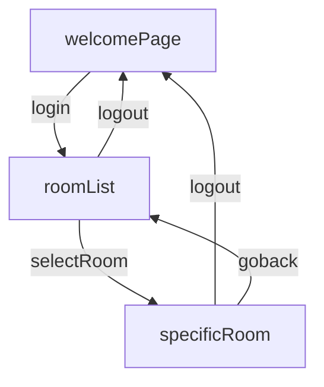

# live chat app

this application is a home work for cantek Oct

<detail>
<summary> vite react-ts template original doc</summary>

# React + TypeScript + Vite

This template provides a minimal setup to get React working in Vite with HMR and some ESLint rules.

Currently, two official plugins are available:

-   [@vitejs/plugin-react](https://github.com/vitejs/vite-plugin-react/blob/main/packages/plugin-react/README.md) uses [Babel](https://babeljs.io/) for Fast Refresh
-   [@vitejs/plugin-react-swc](https://github.com/vitejs/vite-plugin-react-swc) uses [SWC](https://swc.rs/) for Fast Refresh

## Expanding the ESLint configuration

If you are developing a production application, we recommend updating the configuration to enable type aware lint rules:

-   Configure the top-level `parserOptions` property like this:

```js
   parserOptions: {
    ecmaVersion: 'latest',
    sourceType: 'module',
    project: ['./tsconfig.json', './tsconfig.node.json'],
    tsconfigRootDir: __dirname,
   },
```

-   Replace `plugin:@typescript-eslint/recommended` to `plugin:@typescript-eslint/recommended-type-checked` or `plugin:@typescript-eslint/strict-type-checked`
-   Optionally add `plugin:@typescript-eslint/stylistic-type-checked`
-   Install [eslint-plugin-react](https://github.com/jsx-eslint/eslint-plugin-react) and add `plugin:react/recommended` & `plugin:react/jsx-runtime` to the `extends` list

</detail>
<detail>
<summary> class requirement</summary>

# Live Chat Application

## Overview

This documentation guides you through the process of setting up and developing a Live Chat
application using Firebase for user authentication (Google Sign-On) and Firestore Database for
storing user data, chat rooms, and messages. The application will be built using a JavaScript
framework/library of your choice (such as CRA, Vite, or Next.js) and TypeScript for static type
checking. The styling is completely up to you.
Example: https://adorable-sundae-5e3ea6.netlify.app

## Firebase Configuration

You will need to create a firebase.config.ts file to configure and initialize your Firebase project.
Ensure that you have created a new project on the Firebase console
(https://console.firebase.google.com), and follow the instructions to set up Firebase in your
application.

## Production Mode and Firestore Rules

Before proceeding with the implementation, ensure that your project is set in production
mode. Additionally, navigate to your Firestore settings and enable ‘allow read, write: if true;’.
This will allow you to add data to the database.
Authentication and User Profile Creation

## Authentication

Create an auth file to handle user authentication. Implement two asynchronous functions: one
for signing in with Google (signInWithGoogle) and another for signing out (signOut). TypeScript
should be used to define the types of these functions and their return values.

## User Profile

Upon successful user authentication, automatically create a user profile document in Firestore
under a users collection. This document should store the user’s display name, email, and a
timestamp of when the profile was created (createdAt).

## Routing and Navigation

In your App.tsx file, set up the necessary routes using BrowserRouter, Routes, and Route.
Include a Layout or Navigation component with an Outlet where the main content will be
rendered. Utilize Link or navigate from react-router-dom for in-app navigation.
Pages and Components
Room Creation Modal
Create a modal component for adding new chat rooms. This functionality should only be
available to authenticated users. If the user is not signed in, hide the “Create Room” button.

## Rooms Page

Implement a Rooms page to display a list of available chat rooms, including the room name, list
of users, creation timestamp, and the join date of each user. Each room in the list should be
clickable, navigating the user to the specific chat room when selected.
Specific Room Page
On this page, display the room’s name and a list of messages. Show the sender’s display name,
the message content, and the timestamp of when the message was sent. Differentiate
messages sent by the current user from those sent by others using different colors and
alignments. If the user is not signed in, disable the message input and display a prompt to sign
in.

## Loading and Error Handling

Implement a loading state to provide feedback to the user while data is being fetched.
Additionally, create a NotFound route to handle invalid URLs.

## Firestore Interaction

Create a firestore file to handle interactions with Firestore. Implement the following functions:
 createUserProfile: To create a new user profile document.
 createRoom: To create a new chat room.
 getRooms: To retrieve the list of chat rooms.
 sendMessage: To send a message in a specific chat room.
 getMessages: To retrieve messages from a specific chat room.
 getUsers: To retrieve the list of users.
Ensure to include proper TypeScript types and imports.

## Real-Time Updates

Set up subscriptions to listen for real-time updates in chat rooms, messages, and user lists. This
will allow the application to update the UI instantly when new messages are sent or when
changes occur, without requiring a page refresh.
Message Ordering and Display
Display messages in reverse chronological order, with the most recent messages at the bottom.
Consider implementing a scrolling chat feature to keep the input bar in view as the message list
grows.

</detail>

# Objective

get familiarize with firebase auth + cloud firestore

# specification

## getting started

### prerequsite

-   node v18 +
-   npm installed
-   git installed

### steps

```shell
git clone this repo
npm install
# fill in the
npm run dev
```

### flow chart



# Difficulties

-   This is the first time I use firebase, google docs support lots of language and has multiple version, it is difficult to locate right specification
-   time collision with moving and group project

# extension

-   support multimedia
-   support notification
-   better UI
-   security
